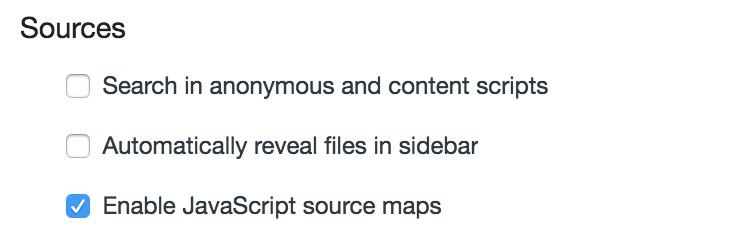
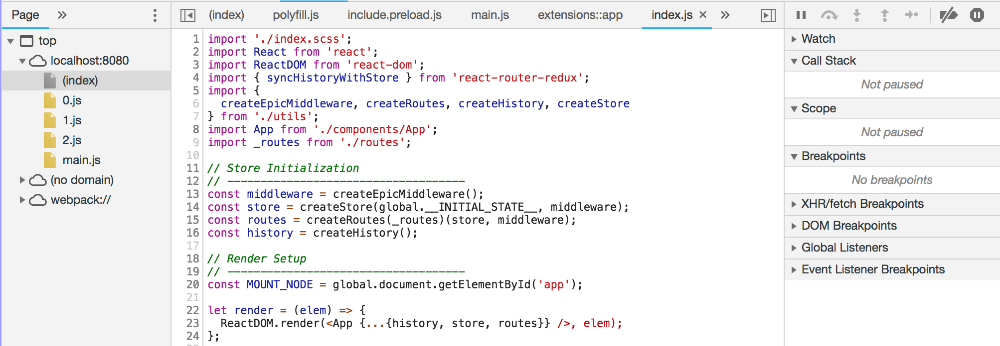

## Table of Contents

1. [Requirements](#requirements)
1. [Development](#development)
  * [File format](#editor-configuration)
  * [Code styling](#code-styling)
  * [Source maps](#source-maps)
  * [Commit Style](#commit-style)
  * [Git Repository](#git)
    - [Commit Style](#commit-style)
    - [Work Flow](#work-flow)
1. [View rendering](#view-rendering)
  * [React](#)
1. [Routing](#routing)
  * [Declarative](#react-route-declarative)
1. [State handling](#state-handling)
  * [Redux](#)
1. [Async side effects]
  * [Redux Observable](#)
  * [RxJS](#)

## Requirements

* __node__@`^v8.12.0`
* __npm__@`^6.4.1` or __yarn__@`^1.3.2`

## Development

### File format

You need a [editorconfig](https://editorconfig.org/) plugin in order to read the `.editorconfig` located at root folder to keep the file formats homogeneous for everyone who work with this project.

`Note`: Windows user must check the `git client` configuration `autocrlf`, please disable it using this command.

```
git config --global core.autocrlf false
```

### Code Styling

To keep all the code style homogeneous you must use [ESLint](https://eslint.org/) plugin in your editor. The configuration is located inside `.eslintrc`, you can configure your linter plugin to fix your files when save.

### Source Maps

When you launch the `npm start` by default source maps will be generated, if you experiment any problem make sure you have enabled the configuration in your browser




You should be able to see the uncompiled code from your `source` tab



### Git Repository

#### Commit Style

* __feat__: A new feature
* __fix__: A bug fix
* __docs__: Documentation only changes
* __style__: Changes that do not affect the meaning of the code (white-space, formatting, missing semi-colons, etc)
* __refactor__: A code change that neither fixes a bug nor adds a feature
* __perf__: A code change that improves performance
* __test__: Adding missing tests
* __chore__: Changes to the build process or auxiliary tools and libraries such as documentation generation

#### Work flow

One of the most important things to consider when work with other developers in the same project, is prevent conflicts when try to merge push or pull changes in your repository. [Git flow](https://danielkummer.github.io/git-flow-cheatsheet/) tries to make this easier with a workflow thats allows you work in parallel and integrate the changes using `pull requests`.

Always you have to make any kind of change in your code (BugFix, HotFix, Feature) you must create a new branch using the specification bellow:

##### Features such improve or provide functionality
`feature/[JIRA_CODE]\_NAME\_WITH\_UNDERSCORE\_AS\_SPACES`
##### Fix of bug detected in master or production phase
`hotfix/[JIRA_CODE]\_NAME\_WITH\_UNDERSCORE\_AS\_SPACES`
##### Version launched at its latest revision
`release/v1.0.1`
##### Functionality or fixing a LTS version (Long Time Support)
`support/[JIRA_CODE]\_NAME\_WITH\_UNDERSCORE\_AS\_SPACES`

#### Git flow tool

In order to make easier this task you can use `git-flow` command as shown bellow


#### Workflow

The following picture show clearly how its works.


## Routing


### React Route declarative

folder /src/routes/[Route]/index.js

[routing](https://github.com/jeffbski/react-boilerplate-logic/blob/master/docs/js/routing.md)

To declare a route that requires async load to chunk your bundle you can use :

```javascript
import createRoute from '@local/utils/createRoute';
import HomeView from '@local/components/HomeView';

export default createRoute('home', {
  path: '/',
  layout: LayoutMain,
  component: HomeView
});
```


To declare a route that requires async load to chunk your bundle you can use : the second arguments specifies the redux reducer and 'redux-obsevable epics'

```javascript
import createRoute from '@local/utils/createRoute';
import LayoutMain from '@local/layouts/LayoutMain';

export default createRoute('home', {
  path: '/',
  layout: LayoutMain,
  component: () => [
    import('./components/HomeView'), {
      reducer: import('./reducers'),
      epic: import('@local/epics/users')
    }]
});
```

### State handling

https://medium.com/mofed/reduxs-mysterious-connect-function-526efe1122e4

```javascript
import {combineReducers} from 'redux';

const defaultUserState = {
  name: 'Pepe',
  surname: 'González',
  loading: false
};

export default combineReducers({
  user: (state = defaultUserState, action) => {
    switch (action.type) {
      case 'USER_LOAD_SUCCESS':
        return {
          ...state,
          ...action.payload
        };
      case 'USER_LOADING':
        return {
          ...state
        };
      default:
        return state;
    }
  }
});
```
### Async side effects
```javascript
import { combineEpics, ofType } from 'redux-observable';
import { switchMap, delay, startWith } from 'rxjs/operators';
import { of } from 'rxjs';

export const getUsers = action$ => action$.pipe(
  ofType('USER_LOAD'),
  switchMap(q => of({
    type: 'USER_LOAD_SUCCESS',
    payload: {
      name: 'Tarek',
      surname: 'AKG47'
    }
  }).pipe(
    delay(1500),
    startWith({type: 'USER_LOADING'})
  ))
);

export default combineEpics(
  getUsers
);
```
